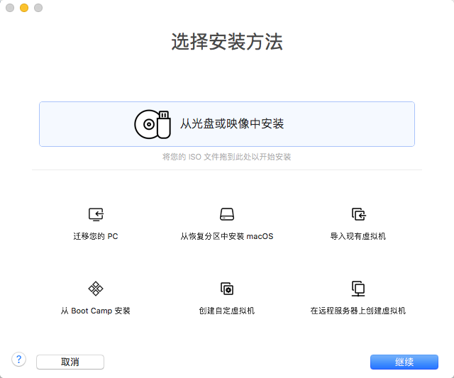
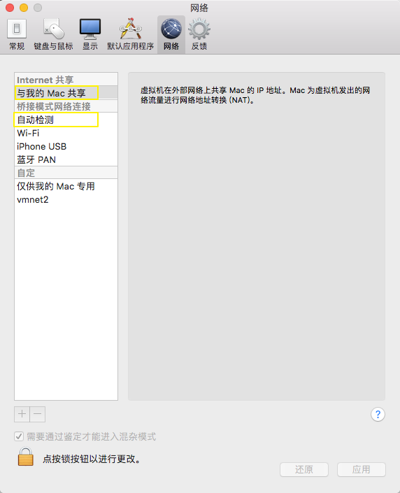
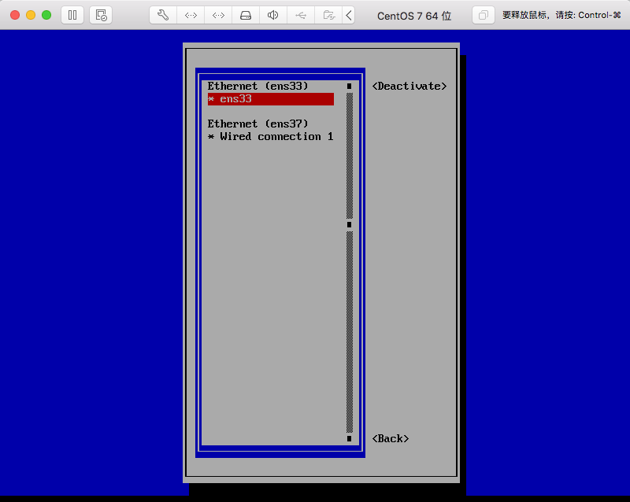
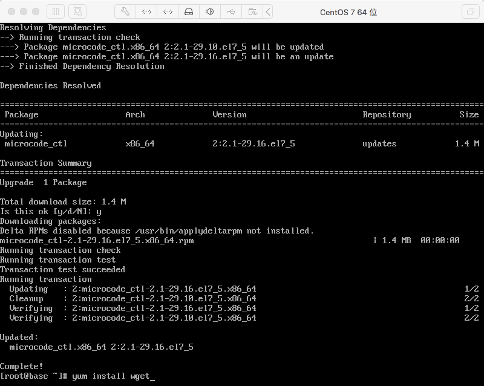
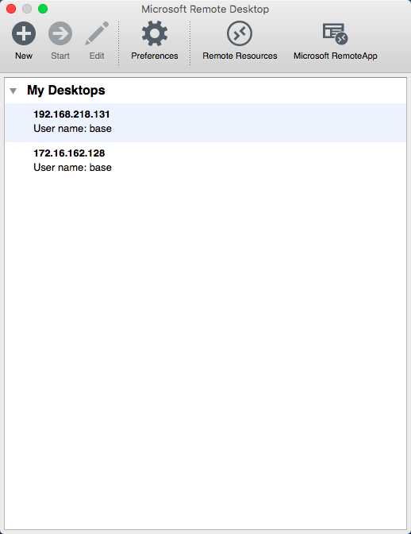
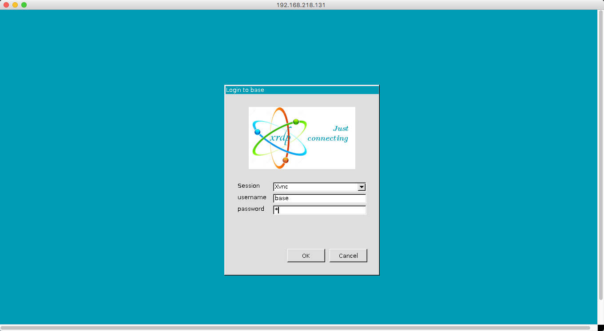

# Sevice Computing

**Principle, Technology and Architecture for building effitive, elastic and solid services on cloud**

## 概述：

上学期有幸学习了云计算概论这门课，初窥了一直很热门的却又陌生的云计算，以我个人粗浅的理解，它是依赖于由WSC（仓储级计算机）构成的巨型数据中心，即性能强大的底层基础设施，通过虚拟化的技术和互联网，提供PaaS（软件即服务）的其中一种交付方式，而软件开发者可以利用云平台开发运算能力更强大的应用程序，尤其是针对大数据的处理和分析，为用户减少了时间和空间上的消耗。按需使用和弹性的服务技术也为企业减少了不少维护成本。


## 实验1 安装配置自己的私有云

实验环境

- macos  high sierra 10.13.4
- VMware Fusion

> **需要注意的是云计算与虚拟化并非是一回事，利用虚拟化可以实现云计算的所有功能。云计算是指通过 Internet 按需交付共享计算资源（软件和/或数据）。无论是否位于云环境之中，都可以首先将服务器虚拟化，然后迁移到云计算，以提高敏捷性并增强自助服务。** 
>

### 1、使用VMware安装虚拟机

什么是虚拟机：

> 虚拟计算机系统被称为“虚拟机”(VM)，它是一种严密隔离的软件容器，内含操作系统和应用。每个功能完备的虚拟机都是完全独立的。通过将多台虚拟机放置在一台计算机上，可仅在一台物理服务器或“主机”上运行多个操作系统和应用。名为“hypervisor”的精简软件层可将虚拟机与主机分离开来，根据需要为每个虚拟机动态分配计算资源。

 首先通过教育网连接清华开源镜像站高速下载[centos7-Minimal-ISO](https://mirror.tuna.tsinghua.edu.cn/centos/7.5.1804/isos/x86_64/)，安装过程没有遇到什么问题就不赘述了。

因为之后需要用到GNOME桌面环境和Chrome浏览器，所以虚拟机配置采用2核，2G内存，30G磁盘。



其次进入偏好设置-网络，发现VMWare已经配置好了NAT模式和桥接模式的两种虚拟网卡，故在虚拟机中设置两个网络适配器，一个连外网，一个供主机和虚拟机之间进行专用连接。




配置好了虚拟机后，还需要通过nmtui命令启动两块网卡的服务。其中ens33为专用网络网卡，ens37为NAT网卡。



由于桥接模式设置的是自动检测，需要再通过ip addr命令查看虚拟机在专用网络中的IP地址，以便主机ping和ssh。


在主机通过ifconfig命令查看Host-Only那块网卡的地址。看到vmnet1即为NAT模式使用的网卡，vmnet8即为桥接模式（Host-Only）使用的网卡。发现IP地址前24位与虚拟机中的相同，说明和虚拟机处于同一个网络中。


最后主机ssh虚拟机成功。


虚拟机ping主机成功。


### 2、升级OS内核

CentOS7默认有浙江大学的镜像源，能够利用高速的教育网来完成 yum 的包安装和更新。如果遇到问题请[更换yum源](https://www.cnblogs.com/wujinghua/p/8552785.html)

```bash
yum update
yum install wget
yum install kernel-devel  #安装内核的头文件，开发需要用到
```




### 3、拷贝多个虚拟机

为了提高云服务的可靠性和弹性，需要在一台宿主机上配置多个冗余的虚拟机以应对出现问题时的数据迁移。在 VMWare中，包括许多VPS的云托管商，首先会创建一个当前虚拟机的快照，然后用快照生成一个与原虚拟机独立的系统。

其中有两种不同的复制方式：**链接复制** 和 **完整复制**。其中，链接复制的虚拟机虽然和原虚拟机在运行上是独立的，但是仍旧使用原系统的磁盘空间，而所有对于原虚拟机快照中文件的修改将会被存储在一个“差量磁盘”上。这种方法的好处是省去了创建新虚拟磁盘的时间，使得两个虚拟机共享一套快照文件，节约磁盘空间。而后者则是单独开辟虚拟磁盘，并在之上创建虚拟机。


需要注意的是，虚拟机中网卡的 MAC 地址必须不同，同样使用nmtui开启两块网卡，因为宿主机的虚拟网卡（Host-Only）均配置了 DHCP 服务，子网中的设备会自动获得不冲突的 IP 地址。


宿主机ssh克隆机成功。


### 4、配置桌面环境

```bash
#安装桌面 
yum groupinstall "GNOME Desktop" 
#设置图形化组建为启动目标
ln -sf /lib/systemd/system/runlevel5.target /etc/systemd/system/default.target 
#重启
shutdown -r now 
```

启动两个网络服务。


### 5、远程桌面连接

因为苹果上的apple remote收费，所以安装MS为macOS用户提供的[Mircosoft Remote Desktop （远程桌面连接）](https://zhuanlan.zhihu.com/p/34202380)

添加虚拟机IP。



因为微软的远程桌面连接软件支持的是`rdp` 协议，而 Linux 中需要通过额外的组件 `Xrdp` 来支持这种协议的远程桌面。所以在连接虚拟机之前，需要配置安装这个组件。

首先配置 EPEL 源，这是对于 CentOS 原生 yum 源的补充。

```bash
#sudo获得管理员权限
yum install -y epel-release.noarch #如果没有可用yum search epel搜索相关源 
yum install xrdp 
yum install tigervnc-server
```

启动xrdp

```bash
systemctl start xrdp
systemctl enable xrdp #添加开机启动
```

查看端口

```bash
netstat -antup | grep xrdp
```


此时3389端口负责监听rdp协议。

然后关闭防火墙，将端口号暴露，同时为 XRDP 开启 Selinux (控制程序的访问权限)认证

```bash
firewall-cmd --permanent --add-port=3389/tcp
firewall-cmd --reload
chcon --type=bin_t /usr/sbin/xrdp
chcon --type=bin_t /usr/sbin/xrdp-sesman
```

最后尝试连接。




大功告成。

