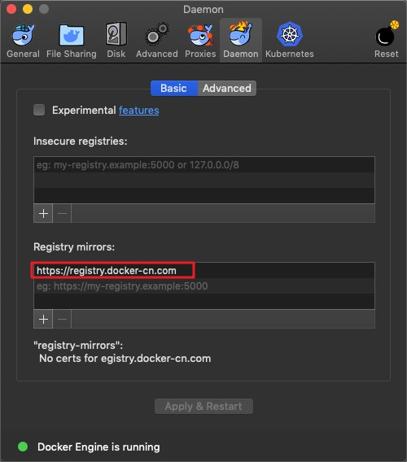
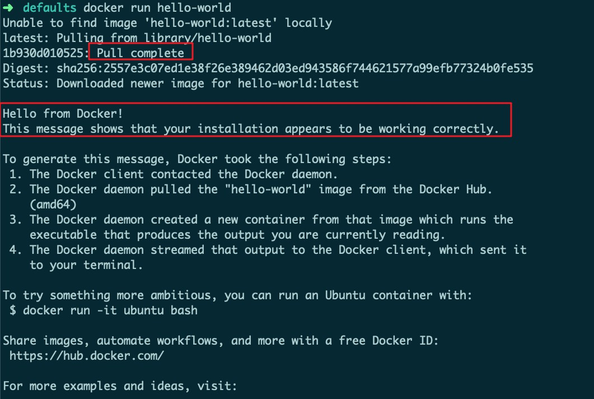
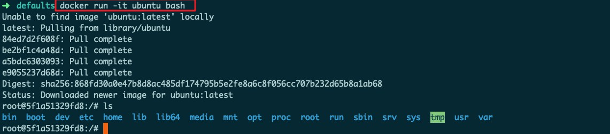

# 容器化技术与容器服务

## [Install Docker on MacOS](https://docs.docker.com/docker-for-mac/install/) 

https://mirrors.tuna.tsinghua.edu.cn/docker-ce/mac/static/stable/x86_64/

Docker 中国官方镜像加速可通过 registry.docker-cn.com 访问。该镜像库只包含流行的公有镜像。私有镜像仍需要从美国镜像库中拉取。

`https://registry.docker-cn.com`





Docker 需要用户具有 sudo 权限，为了避免每次命令都输入`sudo`，可以把[用户加入 Docker 用户组](https://docs.docker.com/install/linux/linux-postinstall/#manage-docker-as-a-non-root-user)


`docker run hello-world`测试安装成功




运行其他镜像`docker run -it ubuntu bash`




```bash
docker images 等价于 docker image ls
docker ps 等价于 docker container ls
```

仓库中保存若干版本镜像，每个镜像对应一个 tag，默认的 tag 是 lastest


## MySQL与容器化

`docker pull mysql:5.7`

